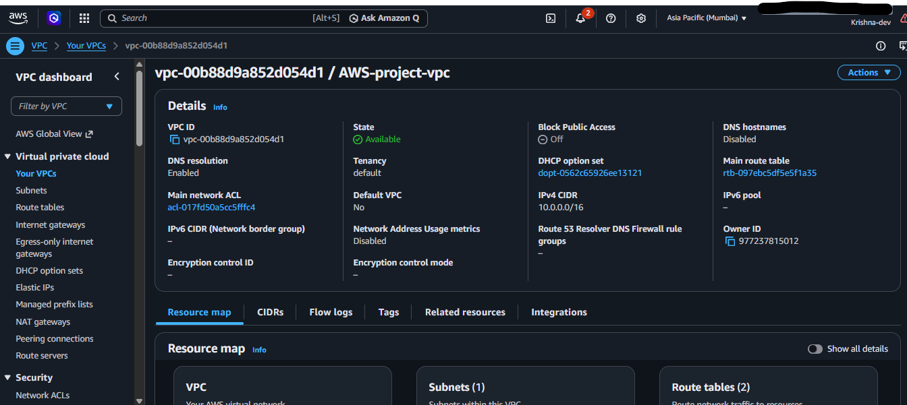
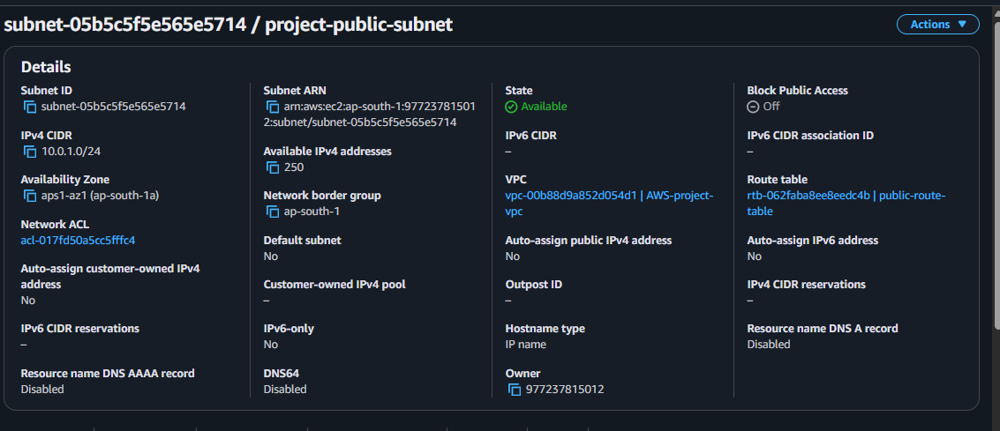
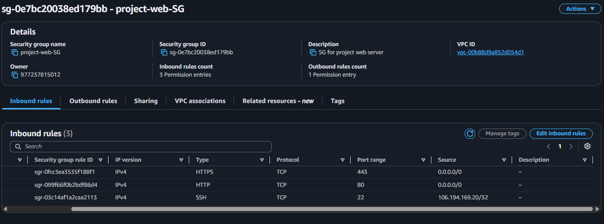
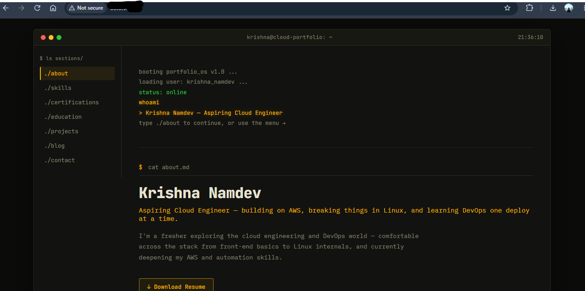

<-------------AWS infrastructure , Monitoring and troubleshooting-------------->

# AWS Cloud Infrastructure Lab

-This is a hands-on AWS project that I built to understand how a
basic web server works in AWS.

I didn't want to just study AWS services separately, so I created
the infrastructure myself and connected the different parts
together.

The first version includes a VPC, public subnet, EC2, Nginx,
CloudWatch monitoring and a Bash health-check script.

# What I built

- Created a VPC and public subnet
- Connected the subnet to the internet using an Internet Gateway
- Created a route table and security group
- Launched an Ubuntu EC2 instance
- Installed Nginx
- Hosted my portfolio website on the EC2 instance
- Added CloudWatch monitoring for CPU, memory and disk
- Created a CPU alarm with SNS email notification
- Wrote a Bash script to check server health
- Tested an Nginx failure and fixed it using systemctl

# Architecture

I documented the Version 1 architecture separately, including the
architecture diagram and explanation.

[View Version 1 Architecture](./architecture/architecture-v1.md)

# Version 1

The current version looks like this:

 Internet
    |
Internet Gateway
    |
   VPC
    |
Public Subnet
    |
   EC2
    |
  Nginx
    |
Portfolio Website

# EC2 :-

 EC2
  |
CloudWatch
  |-- CPU
  |-- Memory
  |-- Disk
  |-- Nginx logs

 EC2
  |
Bash health check

# AWS services used

- VPC
- EC2
- IAM
- CloudWatch
- SNS
- Internet Gateway
- Route Table
- Security Group

## Evidence

### AWS Infrastructure

### Website

### Monitoring

### Troubleshooting

# Why I built this

I wanted to get practical experience with the basic things
that are involved when deploying and monitoring a server in AWS.

The main focus was not just creating the resources, but also
understanding how they communicate and how to troubleshoot
when something goes wrong.

# Current status

Version 1 is complete.

Version 2 will add a private subnet and RDS.
