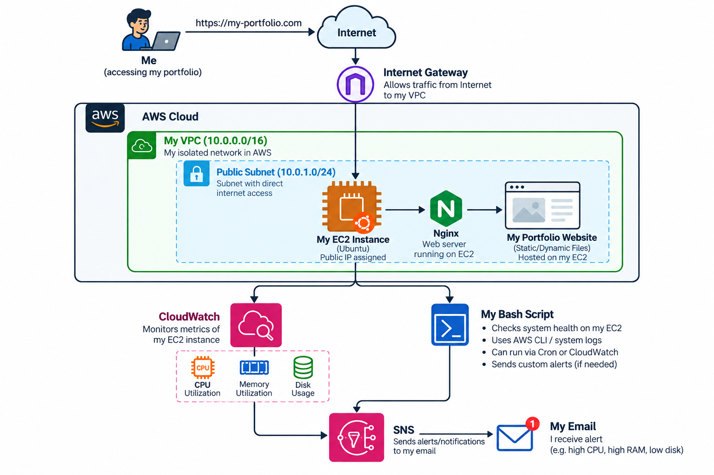

# Version 1 Architecture

# Architecture Diagram

# Overview

-This is the first version of my AWS cloud infrastructure project.
-I created a VPC with a public subnet and launched an Ubuntu EC2
instance inside it.

-The EC2 instance is used to host my portfolio website using Nginx.

-CloudWatch is connected to the EC2 instance for monitoring, and I
also created a Bash health-check script to check the server status.

# Architecture Flow

Internet
  ↓
Internet Gateway
  ↓
 VPC
  ↓
Public Subnet
  ↓
 EC2
  ↓
Nginx
  ↓
Portfolio Website

# -------------- Main Components------------------------------>

# 1. VPC

-I created a VPC with the CIDR:

[ 10.0.0.0/16 ]

This is the main private network where my AWS resources are placed.

# 2. Public Subnet

-The EC2 instance is placed inside:

[ 10.0.1.0/24 ]

-This subnet is public because its route table has a route to the
Internet Gateway.

# 3. Internet Gateway

-The Internet Gateway provides a path between the VPC and the internet.

The route table contains:

0.0.0.0/0 → Internet Gateway 

# 4. Route Table

The public route table has:

- 10.0.0.0/16 → local
- 0.0.0.0/0 → Project-IGW

The public subnet is associated with this route table.

# 5. Security Group

-The EC2 instance uses [ Project-Web-SG ]

-Inbound traffic allowed:

- SSH (22) → My IP
- HTTP (80) → Internet
- HTTPS (443) → Internet

SSH is restricted to my IP because it is used for administration.

# 6. EC2

-I launched an Ubuntu EC2 instance in the public subnet.

-The instance runs Nginx and hosts my portfolio website.

# 7. Nginx

-Nginx works as the web server.

-When someone opens the EC2 public IP in a browser, the request reaches
Nginx and Nginx serves the website files.

# 8. CloudWatch

-CloudWatch is used to monitor the EC2 instance.

-I configured monitoring for:

- CPU
- Memory
- Disk
- Nginx access logs

# 9. CPU Alarm and SNS

-I created a CloudWatch alarm for high CPU usage.

-The alarm triggers when CPU usage stays above 80% for 5 consecutive
1-minute periods.

-SNS sends an email notification when the alarm is triggered.

# 10. Bash Health Check

-I also created a Bash script that checks:

- Nginx status
- Website response
- Disk usage

-I intentionally stopped Nginx to test the script and then started it
again after identifying the problem.

## Request Flow

When I open my website:

1. The browser sends a request to the EC2 public IP.
2. The request reaches the Internet Gateway.
3. The VPC routes the traffic to the public subnet.
4. The security group checks whether the traffic is allowed.
5. The request reaches the EC2 instance.
6. Nginx receives the HTTP request.
7. Nginx serves my portfolio website.

## Monitoring Flow

EC2
↓
CloudWatch Agent
↓
CloudWatch
├── CPU
├── Memory
├── Disk
└── Nginx Logs
 

CloudWatch CPU Alarm
  ↓
 SNS
  ↓
Email Notification

## Version 1 Status

This is Version 1 of my project , which is complete.

In Version 2, I plan to add a private subnet and an RDS database.
